> **注意：この文書はAIによる自動翻訳です。内容に誤りが含まれる可能性があります。正確な内容は[オリジナル（英語）](https://data-analysis-chiba.github.io/day2/day02_intro_to_git.html)をご参照ください。**

## 学習目標

この授業の終わりまでに、あなたは以下ができるようになります：

- バージョン管理とは何か、なぜ重要なのかを概念的に理解する
- Git、GitHub、Gitクライアントの違いと関係を説明できる
- GitHubのブラウザインターフェースに慣れ、リポジトリの内容を閲覧したり、Issueを作成したりといった基本操作ができる
- GitとGitHubを使うための環境をセットアップできる
- Gitの基本的なワークフロー（作成、クローン、ステージ、コミット、プッシュ、プル）を実践できる
- この授業での課題提出の主要な手順を理解する

## パート1：バージョン管理、Git、GitHub、Gitクライアントとは？

これらの用語は最初は少し難しく感じるかもしれませんが、心配しないでください。すべてはあなたの作業を楽にするために作られたものです。もし初めてなら少し慣れが必要ですが、この授業では必要なことを一つずつ丁寧に説明していきます。

### Gitの基本

バージョン管理はソフトウェアエンジニアの必須ツールの一つです。[The Guardian](https://www.theguardian.com/technology/blog/2008/aug/19/howmanypeoplemakewindows7)によると、900人以上の開発者がMicrosoft Windows 7の開発に関わったそうです。これだけ多くの人が一つのプロジェクトに関わると、1日、あるいは1時間のうちに何度もコードが変更されます。誰が、何のために、どこを変えたのか？複数人が同じファイルや同じ行を同時に編集したらどうなるでしょう？

バージョン管理システムは、ファイル（多くの場合ソフトウェアのソースコード）の変化の履歴をきれいに、かつ簡単にたどれるように記録します。また、複数人が同じファイルを同時に編集した場合など、問題が起きたときに解決する仕組みも備えています。

Gitは数あるバージョン管理システムの一つですが、非常に人気があります。他にも[Mercurial](https://www.mercurial-scm.org/)、[Perforce](https://www.perforce.com/)、[Subversion](https://subversion.apache.org/)などがあります。

この[動画](https://git-scm.com/video/what-is-version-control)も参考にしてください。

### なぜGit？（[Happy Git and GitHub for the useR 第1.1節](http://happygitwithr.com/big-picture.html#why-git) より抜粋）

Gitはバージョン管理システムです。もともとは大規模なソフトウェア開発プロジェクトで、複数の開発者が協力して作業するために作られました。Gitは「リポジトリ」と呼ばれるファイル群の進化を、理路整然と、かつ高度に構造化された方法で管理します。

もしピンとこなければ、「Microsoft Wordの『変更履歴』機能を超強化したもの」と考えてみてください。

近年、データサイエンス分野でもGitが活用されています。ソースコードだけでなく、データ、図、レポートなど、データ分析プロジェクトを構成する様々なファイルの管理にも使われています。

### なぜGitHub？（[Happy Git and GitHub for the useR 第1.2節](http://happygitwithr.com/big-picture.html#why-github) より抜粋）

ここでGitHubやBitbucket、GitLabなどのホスティングサービスが登場します。これらはインターネット上でGitプロジェクトの「家」となる場所を提供します。

もしイメージが湧かなければ、「DropBoxの超強化版」と考えてみてください。リモートホストは、Gitで管理されたプロジェクトの配布チャンネルや中継所の役割を果たします。他の人があなたの成果物を見たり、同期したり、場合によっては変更を加えることもできます。これらのサービスは、従来のUnix系Gitサーバーよりも、洗練されたWebインターフェースを備えている点が特徴です。

ただし注意が必要です。GitHubなどのサービスはファイル管理には優れていますが、大容量データの保存には向いていません。GitHubはリポジトリのサイズを1GB未満にすることを推奨しています（[参考](https://help.github.com/articles/what-is-my-disk-quota/)）。さらに、100MBを超えるファイルはアップロードできません（[参考](https://help.github.com/articles/working-with-large-files/)）。

個人プロジェクトでも、バックアップのためにリモートにプッシュしておくのは良い習慣です。なぜなら、Gitの操作に慣れていないうちは、ローカルリポジトリを壊してしまうことがよくあるからです。幸い、多くの場合Gitのインフラだけが壊れていて、ファイル自体は無事です。とはいえ、そうしたトラブルはとても厄介です。公式のGitの解決策もありますが、深夜3時に自力で直すのは大変です。最近GitHubにプッシュしていれば、新しいコピーを取得し、ローカルだけの変更をパッチして、すぐに作業を再開できます。

本講義では具体性のためGitHubを使いますが、他のサービス（BitbucketやGitLab）でも基本的な考え方や多くの操作は共通です。

### そもそも何が何なの？

***バージョン管理*** とは、ファイル（主にコードベース）を「管理」するためのソフトウェアシステム全般を指します。Gitはその一例に過ぎません。他にも [Mercurial](https://www.mercurial-scm.org/)、[Perforce](https://www.perforce.com/)、[Subversion](https://subversion.apache.org/) などがあります。

***Git*** はバージョン管理ソフトウェアです。GitHubサーバーとあなたのパソコンの両方で動作します。これにより、パソコンとGitHub上のリモートリポジトリが通信でき、プッシュやプル、履歴管理などの機能が使えます。

***GitHub*** は、リモートリポジトリをクラウド上で管理するサービスです。
グループで作業する場合、あなたや共同作業者はそれぞれ独立して
GitHubとやり取りし、最新のコード変更をプル／プッシュします。
GitHubは、各自がローカルマシンで作業していても、
プロジェクトディレクトリの最新の「真実」を保持します。

***Gitクライアント*** は、Gitとのやり取りを簡単にする
グラフィカルユーザーインターフェースを提供するソフトウェアです。
本講義では **RStudioの内蔵Gitクライアント** を使用します。
他にも [SourceTree](https://www.sourcetreeapp.com/) や
[GitHub Desktop](https://desktop.github.com/) などがあります。
もちろん、ターミナル（コマンドライン）は最も強力ですが、
コマンドラインに慣れていない場合は最も難しい方法です。

## パート2: 環境のセットアップ

Gitを使い始める前に、パソコンに必要なソフトウェアを
インストールする必要があります。このセクションでは、1. Gitのインストール、2. GitHubアカウントの登録、3. SSHキーの設定、4. RStudioからGitを使う方法を説明します。

### 1. Gitのインストール（[Happy Git and GitHub for the useR 第6章](http://happygitwithr.com/install-git.html) より抜粋）

Gitを使うには、コマンドラインで使えること、
そしてRStudioが呼び出せることが必要です。
すでにインストールされている場合は確認して、
問題なければこのステップをスキップしてください。
インストールされていない場合は、以下のOSごとの手順に従ってください。

#### Gitがすでにインストールされているか確認

シェル（ターミナル／コマンドライン）を開き、
`git --version` と入力してEnterを押します。

``` bash
git --version
## git version 2.39.2
```

`git: command not found` のような表示が出た場合は、
OSごとのインストール手順に進んでください。

上記のようにバージョン番号が表示された場合は、
すでにGitがインストールされています。素晴らしい！
ただし、バージョン番号が`2.28`未満の場合は、
アップデートをおすすめします（下記の手順を参照）。
新しいバージョンでは、デフォルトブランチ名を設定できるためです。
Gitコミュニティでは、リポジトリのデフォルトブランチ名を
「master」から中立的で包括的な「main」へ変更する動きがあります。
[GitHubも新しいブランチ名をmainに変更しました](https://www.bbc.com/news/technology-53050955)。
古いバージョンのGitではデフォルトが「master」なので、
新しいリポジトリを作成するたびにローカルのデフォルトブランチ名を
変更する必要があります。バージョン2.28以降なら一度設定すれば
今後作成する全てのリポジトリで有効です。

すでに最新のGitがインストールされていれば、次のステップはスキップできます！

#### WindowsでのGitインストール

[Git for Windows](https://git-for-windows.github.io/) をインストールしてください。
インストール中はデフォルト設定のままで問題ありません。

- Gitの実行ファイルが標準的な場所に配置されるため、
  RStudioなど他のプログラムからも認識されやすくなります。
- Bashシェルも利用できるので、より高度な使い方にも対応できます。
- ただし、付属のGitクライアントはあまり高機能ではありません。
- RStudio for Windowsは、gitがFiles(x86)フォルダにあることを好みます。
  それ以外の場所だと認識されない場合があるので注意してください。

#### MacでのGitインストール

まずXcodeコマンドラインツール（Xcode本体ではありません）を
インストールします。ターミナルを開き、以下を入力してEnterを押します。
表示される指示に従ってください。

``` bash
xcode-select --install
```

インストール後、以下でバージョンを確認します。

``` bash
xcode-select --version
## xcode-select version 2384.
```

次のいずれかのコマンドを入力すると、
開発者コマンドラインツールのインストールを促されます。

``` bash
git --version
git config
```

「Install」をクリックしてインストールしてください。

Xcodeでうまくいかない場合は、
<http://git-scm.com/downloads> からインストールするか、
Homebrewを使っている場合は以下のコマンドを試してください。

``` bash
brew install git
```

インストール後、再度 `git --version` で確認してください。

また、Gitをアップデートした場合は、
[RStudioが正しいバージョンのgitを参照しているか確認](https://happygitwithr.com/rstudio-see-git.html)
しておくと安心です。

#### LinuxでのGitインストール

ディストリビューションのパッケージマネージャーでインストールします。

UbuntuやDebianの場合：

``` bash
sudo apt-get install git
```

FedoraやRedHatの場合：

``` bash
sudo yum install git
```

[他のLinux/Unix用パッケージマネージャーの一覧はこちら](https://git-scm.com/download/linux)

### 2. GitHubアカウントの登録（[Happy Git and GitHub for the useR 第6章](http://happygitwithr.com/install-git.html) より抜粋）

GitHubアカウントをまだ持っていない場合は、
[GitHub](https://github.com) で登録してください（無料です）。

ユーザー名を選ぶ際のポイント：

- 実名を入れると、相手に覚えてもらいやすくなります。
- 他のサービス（TwitterやSlackなど）と同じユーザー名が空いていれば再利用もおすすめです。
- 将来の就職先などに見せても問題ない名前にしましょう。
- 短い方が覚えやすいです。
- できるだけ短く、かつユニークな名前を。
- 所属や居住地など、時期によって変わる情報は避けましょう。
- プログラミングで特別な意味を持つ単語は避けましょう。
  例：ユーザー名にNAを使うと、Rの欠損値と混同されることがあります。

ユーザー名は後から変更できますが、最初にしっかり考えて決めましょう。

- [GitHubユーザー名の変更方法](https://help.github.com/articles/changing-your-github-username/)
- [ユーザー名を変更した場合どうなるか](https://help.github.com/articles/what-happens-when-i-change-my-username/)

### 3. Gitに自分を登録する（[Happy Git and GitHub for the useR 第7章](http://happygitwithr.com/hello-git.html) より抜粋）

まず、Gitに自分の情報を登録します。
ここで入力した情報は、コミットごとに記録され、
誰がどの変更を行ったか追跡できるようになります。
この設定は一度だけでOKです。

シェル／ターミナルで以下を実行します：

``` bash
git config --global user.name ＜あなたのGitHubユーザー名＞
git config --global user.email ＜あなたのメールアドレス＞
git config --global --list
```

### 4. SSHで認証する（[Happy Git and GitHub for the useR 第10章](https://happygitwithr.com/ssh-keys.html) より抜粋）

リモートGitサーバー（例：GitHub）とやり取りする際は、
認証情報が必要です。これにより、あなたが特定のGitHubユーザーであること、
操作権限があることを証明します。

GitはHTTPSまたはSSHのいずれかのプロトコルで通信できます。
ここでは、特別な理由がなければHTTPSを推奨します
（SSHを使いたい場合は[Happy Git and GitHub for the useR 第10章](https://happygitwithr.com/ssh-keys.html)を参照）。
HTTPSでは「パーソナルアクセストークン（PAT）」を使います。

なお、GitHubのWebサイトにログインする際のパスワードは、
Gitサーバーとのやり取りには使えません。
（以前は可能でしたが、現在はGitHubで廃止されています。）
詳細は[Token authentication requirements for Git operations](https://github.blog/2020-12-15-token-authentication-requirements-for-git-operations/)を参照してください。

もしパスワードで認証しようとすると、以下のようなエラーが出ます：

    remote: Support for password authentication was removed on August 13, 2021. Please use a personal access token instead.
    remote: Please see https://github.blog/2020-12-15-token-authentication-requirements-for-git-operations/ for more information.
    fatal: Authentication failed for 'https://github.com/OWNER/REPO.git/'

ここではPATの取得と保存の最小限の手順を紹介します。
もしうまくいかない場合は、担当教員に相談し、
[Happy Git and GitHub for the useR 第9章](https://happygitwithr.com/https-pat.html)も参照してください。

<https://github.com/settings/tokens> にアクセスし、
「Generate token」をクリックします（またはRから `usethis::create_github_token()` を実行）。

スコープ（権限）は「repo」「user」「workflow」などを選択するのがおすすめです。

「Generate token」をクリックします。

生成されたPATをクリップボードにコピーします。
このウィンドウは閉じずに残しておきましょう。
**一度閉じるとPATは再表示できません**（新たに発行は可能です）。
PATはパスワードマネージャーなど安全な場所に保存し、
有効期限まで再利用できるようにしましょう。

次に、PATをパソコンの安全な場所に保存し、gitが認証に使えるように設定します。
Rで行うのが簡単です。

まずRパッケージ "gitcreds" をインストールし、
`gitcreds::gitcreds_set()` を実行してPATを入力します。
これで毎回パスワードやトークンを入力せずにGitHubとやり取りできます。

#### デフォルトブランチ名をmainに設定

最後に、すべての新しいリポジトリでデフォルトブランチ名をmainに設定します。

``` bash
git config --global init.defaultBranch main
```

このコマンドが成功すればOKです。

このコマンドはGit 2.28以降でのみ有効です。
古いバージョンの場合は、リポジトリごとに手動でブランチ名を変更する必要があります。

オプション1：コマンドライン（新しいリポジトリ内で）

``` bash
git branch -M main
```

オプション2：RStudioプロジェクトでusethisパッケージを使う

``` r
# まだインストールしていなければusethisをインストール
install.packages("usethis")
# デフォルトブランチ名をmasterからmainに変更
usethis::git_default_branch_rename(to = "main")
```

## パート3: Create, Clone, Stage, Commit, Push, Pull!

いよいよGitを使い始めます。

タイトルにある6つの動詞（Create, Clone, Stage, Commit, Push, Pull）が、
Gitで行う操作の90%を占めます。
それぞれの意味と手順を簡単に説明します。

RStudioなどのGitクライアントでできることは、
すべてシェル（ターミナル）でも可能です。
ここではRStudioでの操作を中心に説明します。

シェルでの操作に興味がある場合は、
[Software Carpentryのワークショップ教材](https://swcarpentry.github.io/git-novice)
も参考にしてください。

### 概要

**リポジトリ** とは、プロジェクト用のディレクトリです。
通常のディレクトリと違うのは、Gitが管理し、
すべての変更履歴（コミット）を記録している点です。

リポジトリをGitHubに保存したものが「リモートリポジトリ」です。
これを自分のパソコンに **「クローン」** すると、
ローカルリポジトリができます。
**「プッシュ」** や **「プル」** でローカルとリモートの内容を同期します。

例えば、ローカルリポジトリでコードを修正し、
準備ができたら「プッシュ」してリモートリポジトリ（GitHub）に反映します。
グループメンバーは「プル」して最新のリモートリポジトリの内容を
自分のローカルリポジトリに取り込み、作業を続けることができます。

このワークフローの細かい部分は今は分からなくても大丈夫です。
全体像をつかんでおきましょう。
実際に手を動かすことで理解が深まります。

この授業では、新しい課題用リポジトリを作成するところから始めます。
このリポジトリを使って、課題の提出方法を説明します。

### 新しい課題リポジトリの作成

新しい課題を始めるには、Moodleで配布される課題招待リンクが必要です。

Moodleにログインし、コースページに移動します。
「Day 2: Git and GitHub」タブの「First repo」リンクをクリックします。

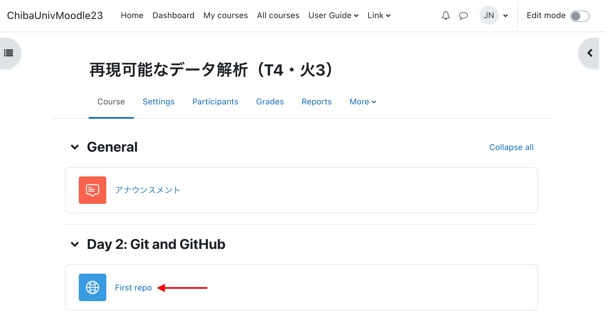

GitHubにログインしていない場合はログインを求められます。
初めての課題の場合は、最初にGitHub IDと名簿の名前を紐付ける画面が表示されます。
その後、「Accept this assignment」ボタン（緑色）をクリックします。

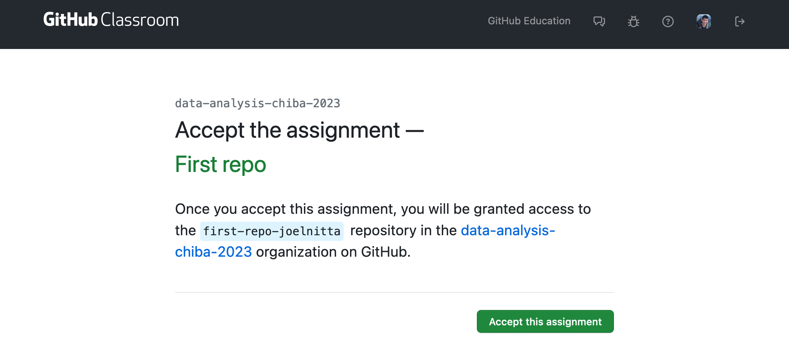

「creating repo」ページに移動します。課題のファイル数が多い場合は数分かかることもありますが、通常はすぐに完了します。ページをリロードしてみてください。

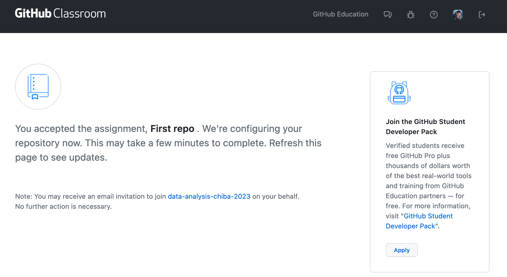

リポジトリの準備ができると、リンクが表示されます。締切がある場合はここに表示されます。

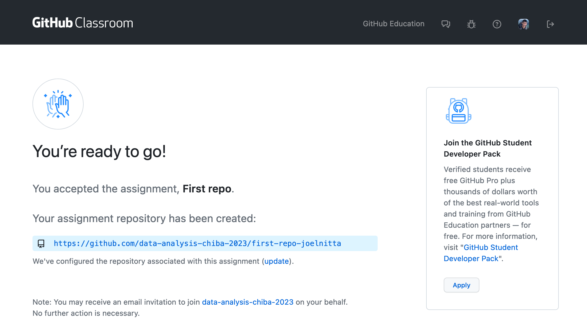

リンクをクリックすると、あなたの新しいリポジトリのGitHubページに移動します。
Webブラウザ上でファイルを閲覧できます（現時点ではまだ空です）。
このリポジトリは「Private」と表示され、あなたと教員だけがアクセスできます。

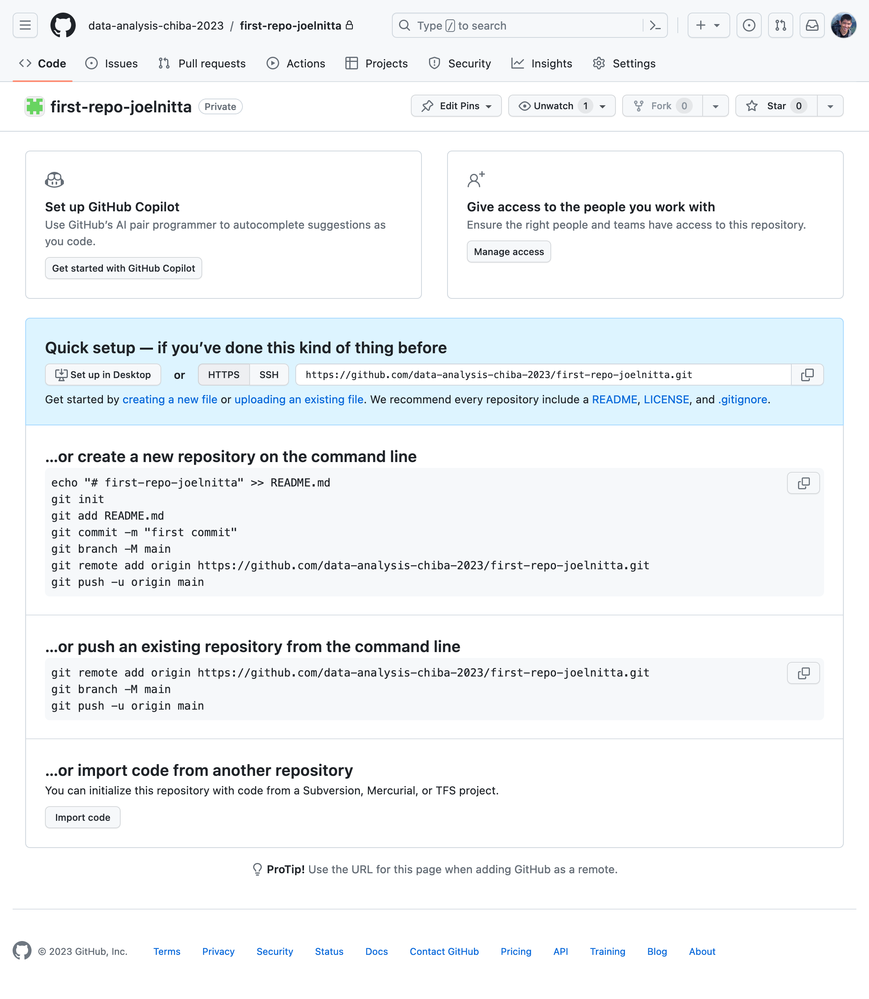

リポジトリが作成できない場合は、教員に相談してください。

*この手順は本講義特有です。一般的な新規リポジトリを作成したい場合は、
GitHubのホーム画面で「New repository」ボタンをクリックしてください。
その際、リポジトリを「Private」（自分だけ）または「Public」（公開）に設定できます。*

### クローン

次に、このリポジトリを自分のパソコンに **クローン** します。
これでローカルで編集できるようになります。

作業前にRStudioの最新版をインストールしておきましょう。

GitHubリポジトリのWebページから **HTTPS**（SSHではなく）リンクをコピーします。
例：
`https://github.com/data-analysis-chiba-2023/first-repo-joelnitta.git`

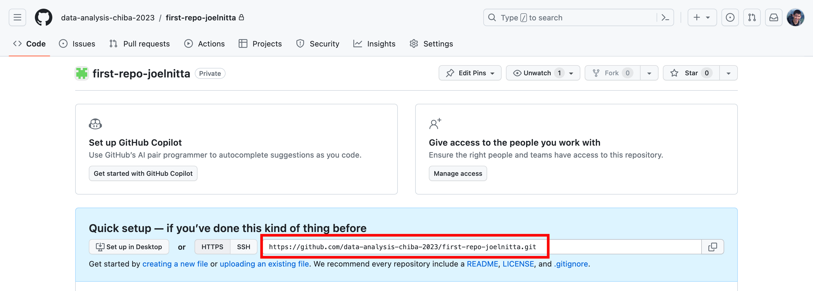

**注意：** 今回は空のリポジトリですが、今後の課題では最初からファイルが入っている場合もあります。
その場合は、ファイル一覧右上の緑色「Code」ボタンから「HTTPS」を選択し、
リポジトリURLをコピーしてください。

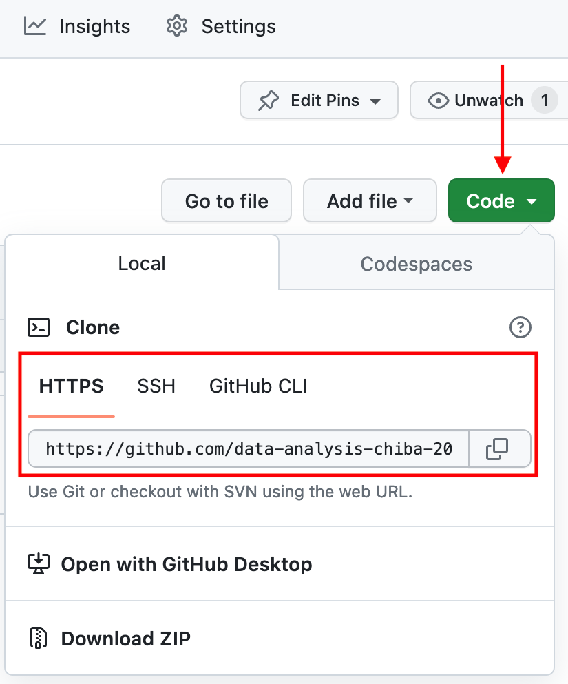

RStudioで新しいプロジェクトを作成します：

- File > New Project > Version Control > Git
- 「repository URL」に先ほどコピーしたURLを貼り付けます。

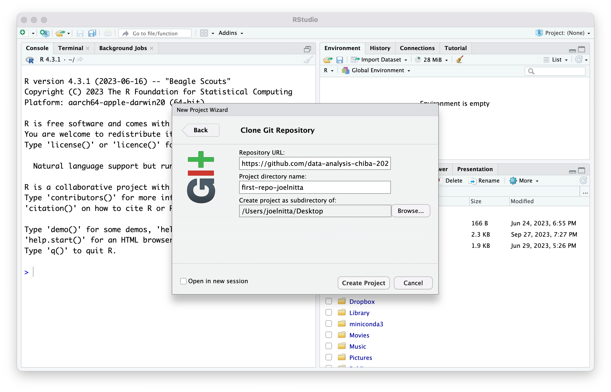

「Version Controlから取得」のオプションが表示されない場合は、
[Happy Git and GitHub for the useR 第13章](http://happygitwithr.com/rstudio-see-git.html)を参照してください。

プロジェクトのローカルディレクトリを必ず確認しましょう。
どこに保存されているか分からなくなるのはよくあるミスです。

複数のプロジェクトを作成する場合は、デスクトップに「data-science-course」フォルダを作り、
その中に各プロジェクトをまとめておくのがおすすめです。

「Open in new session」にチェックを入れると、
新しいウィンドウでプロジェクトが開きます。「Create Project」をクリック。

指定したディレクトリに新しいプロジェクトディレクトリが作成され、
.Rprojファイルが含まれているはずです。
このファイルも後でリモートリポジトリにプッシュします。

RStudioの新しいウィンドウが開き、「Git」タブが表示されていることを確認してください。

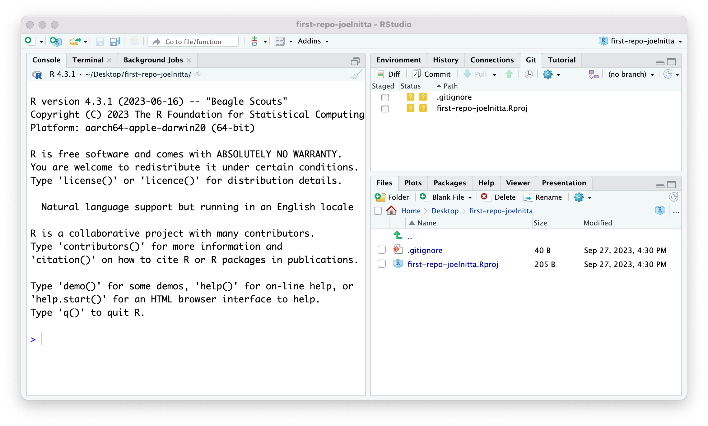

これでローカルにGitリポジトリをクローンできました！

ディレクトリには .Rproj と .gitignore しかありません。
（.gitignoreについては後述します。）

まず最初に追加すべきファイルはREADME.mdです。
GitHubはREADMEファイルを自動的に検出し、
リポジトリのWebページに内容を表示してくれます。

新しいMarkdownファイルを作成し、「This is a line from RStudio」と書いて
README.mdという名前で保存してください。

次に、この変更をGitHubに反映させます。

### ステージ

まず、変更を「ステージ」します。
これはGitHubに「この変更を記録したい」と伝える操作です。

RStudioの「Git」タブでREADME.mdと.Rprojファイルにチェックを入れてステージします。

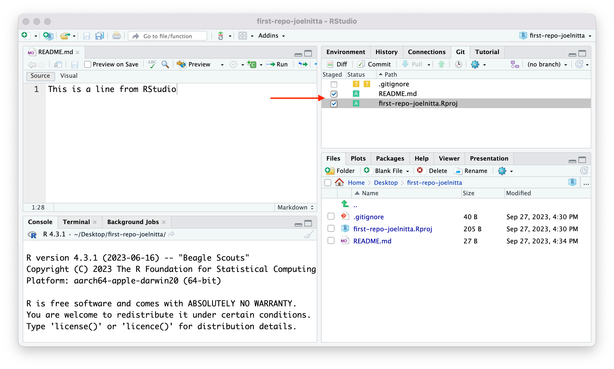

これでGitが新しい変更を認識しました。

コマンドラインの場合は `git add` コマンドで同じことができます。

### コミット

次に「コミット」します。
コミットは、現在のディレクトリの状態を記録する操作です。

RStudioでは Tools > Version Control > Commit（またはGitペインのCommitボタン）をクリック。
各ファイルの変更内容を確認し、コミットメッセージを入力します。
例：「Add README.md and the RStudio project file」

「Commit」と「Close」をクリック。

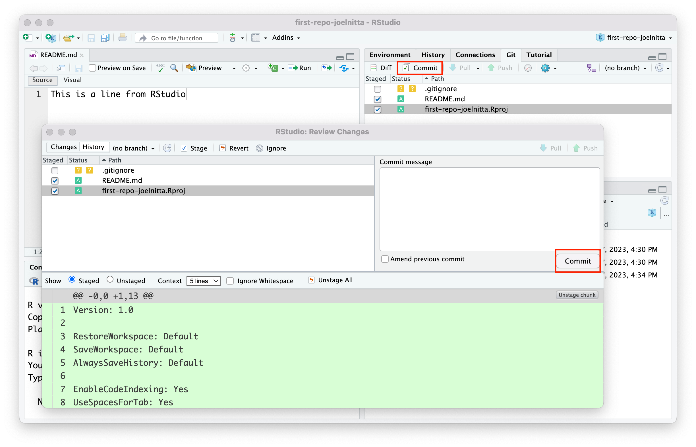

GitHubのリポジトリページを開いても、まだ新しいファイルは表示されません。
驚きましたか？

**重要！** 変更はまだGitHubには反映されていません。
コミットはローカルリポジトリだけの操作です。
これにより、オフラインでも変更履歴を記録できます。
また、リモートリポジトリとのマージ時のトラブルも防げます。
初心者が混乱しやすいポイントなので、しっかり理解しましょう。

### プッシュ

「プッシュ」は、ローカルの変更をGitHubのリモートリポジトリに反映する操作です。
通常、ローカルで複数回コミットした後、まとめてプッシュします。

今回はREADME.mdと.Rprojファイルの追加を1回コミットしたので、
これをプッシュします。

RStudioの緑色の「上矢印」（または Tools > Version Control > Push Branch）をクリック。

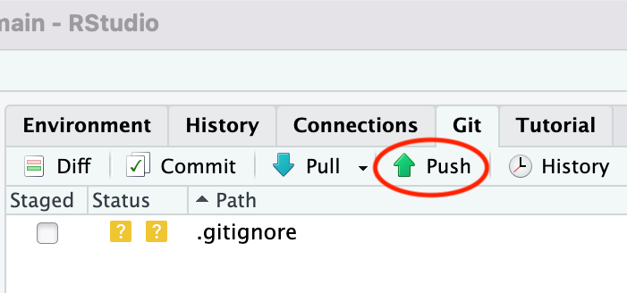

RStudioで以下のようなポップアップが表示されます。

    >>> git push origin HEAD:refs/heads/main
    To github.com:data-analysis-chiba-2023/first-repo-username.git
     * [new branch]      HEAD -> main

GitHubのリポジトリページを再度開くと、

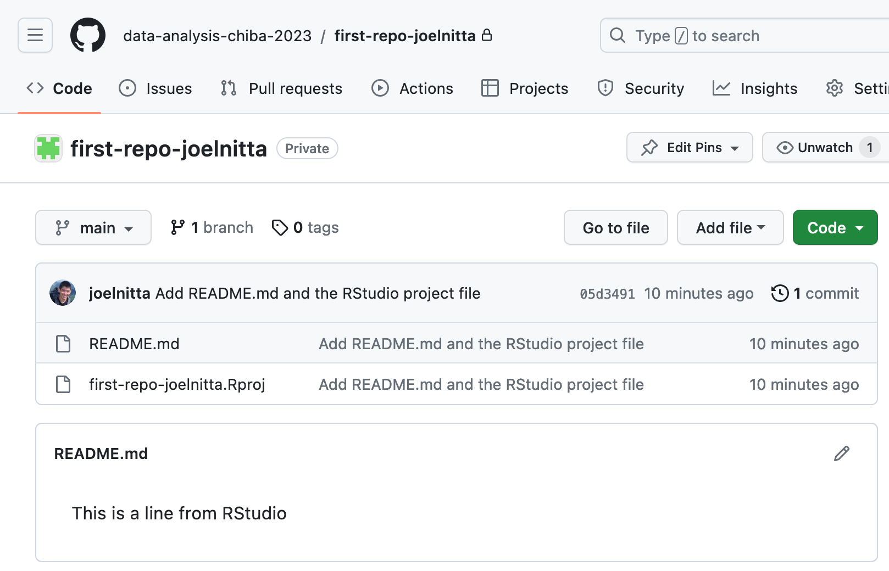

README.mdの内容がリポジトリのホームページに表示されているはずです！

GitHubのUIをいろいろ触ってみましょう。
ファイルや内容の閲覧、コミット履歴の確認、
プロジェクト管理機能（issues, wiki, コントリビューション統計など）もあります。

他の人があなたのリポジトリをクローンしたい場合、
（課題の場合はあなたや教員が）コラボレーターとして追加する必要があります。
デフォルトではリポジトリはあなたと教員だけがアクセス可能です。
「Settings」から変更できます。

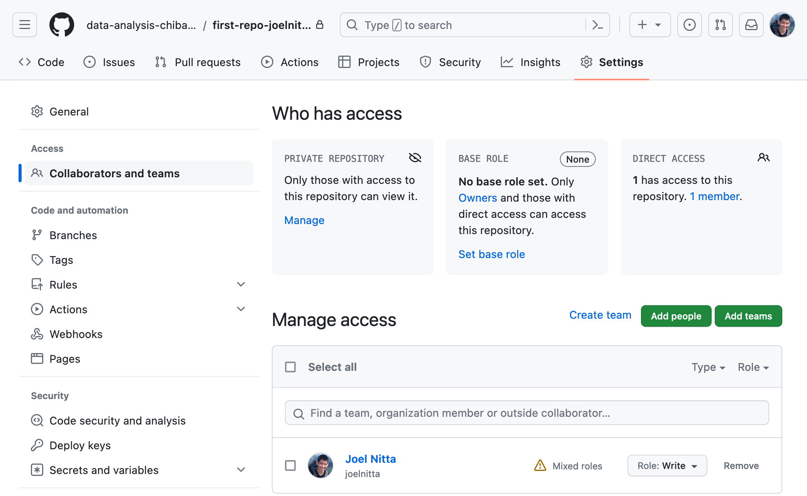

### プル

最後に「プル」操作をデモします。
ここではGitHub上で直接ファイルを編集し、
その変更をローカルに取り込む流れを説明します。
（実際の運用では推奨しません。理由は後述します。）

GitHubのリポジトリページでREADME.mdをクリックし、
右上の鉛筆アイコンをクリック。

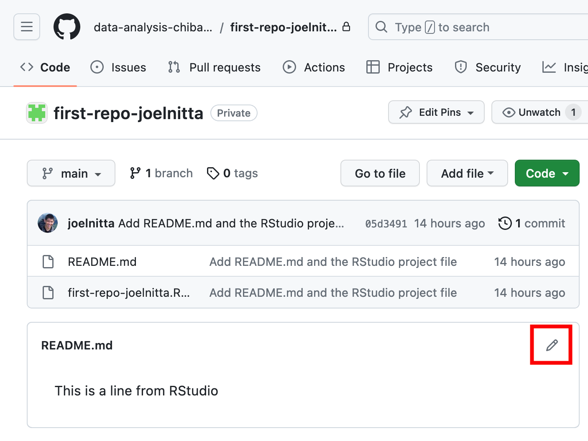

「This change was made directly on GitHub.」と追記し、
コミットメッセージを入力して「main」ブランチに直接コミットします。

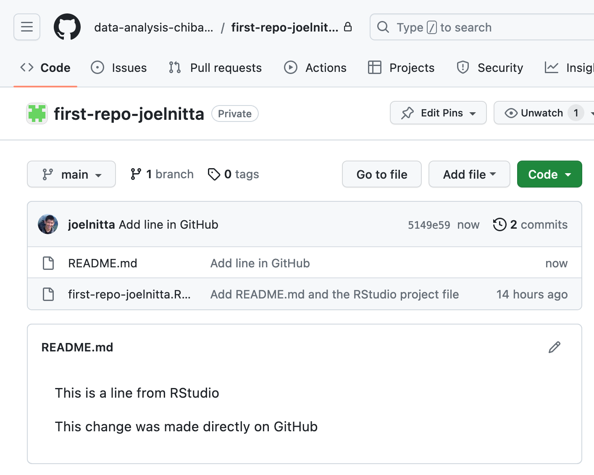

ローカルのREADME.mdはまだ変更前のままです。

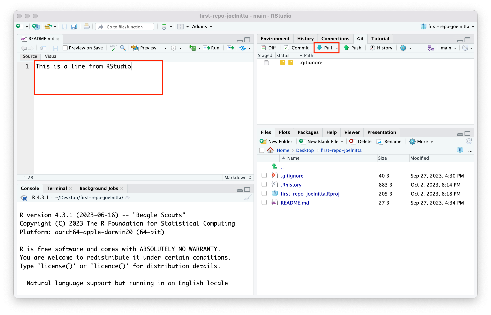

RStudioの青い下矢印（または Tools > Version Control > Pull Branches）をクリック。

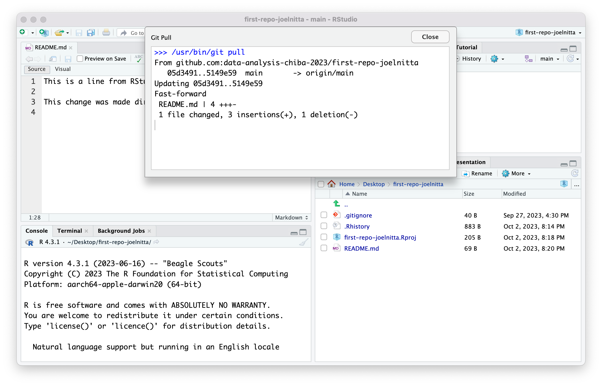

**重要** - 実際の作業では、GitHub上で直接大きな変更を加えるのは避けましょう。
ブラウザはRStudioのエディタより信頼性が低く、
ローカルで未コミットの変更があると競合の原因にもなります。
ここではデモのために行いました。

### .gitignoreについて

これまで無視してきた.gitignoreファイルを見てみましょう。

```
.Rproj.user
.Rhistory
.RData
.Ruserdata
```

これは、これらのファイルをGitの管理対象から除外する設定です。

データセットが100MBを超える場合など、
GitHubのファイルサイズ制限に引っかかることがあります。
その場合、データファイルを.gitignoreに追加して管理対象外にできます。
特定の拡張子をまとめて除外したい場合はワイルドカードも使えます。
例：`*.txt` と書けばtxtファイル全てを無視できます。

GitHubの[.gitignoreテンプレート集](https://github.com/github/gitignore)も参考にしてください。

## パート4: 宿題課題

これでクローン、コミット、プッシュの一連の流れを体験しました。
宿題では、これをもう一度練習します。

まずMoodleでDay 2 Homework課題のリンクをクリックし、
GitHubリポジトリを作成します。

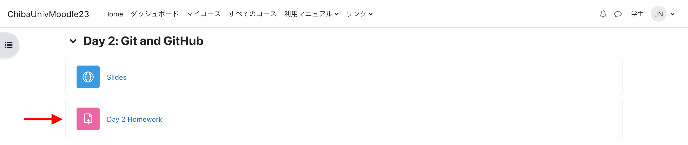

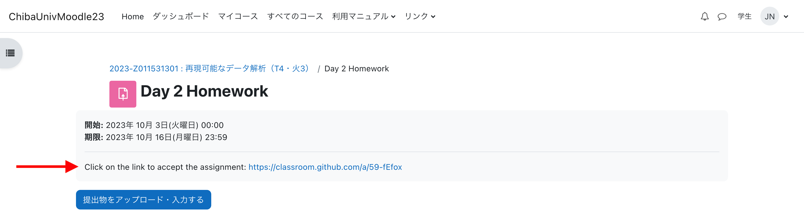

前と同じようにリモートリポジトリをローカルにクローンし、
`git_facts.md` ファイルの空欄を埋めて保存します。
その後、コミットし、リモートにプッシュしてください。

**締切までに必ず行ってください。**

繰り返しますが、**ローカルでコミットし、リモートにプッシュする**
両方を締切前に完了してください。
GitHubで変更が確認できなければ、
正しく提出できていないことになります。
評価は締切前の最新コミットで行われます。
締切後のコミットは無効（採点対象外）です。

提出できたか不安な場合は、
MoodleのリンクからGitHubリポジトリを開き、
自分が編集した内容が反映されているか確認しましょう。

## 追加リソース

もっと学びたい人のための参考資料：

- [Happy Git and GitHub for the useR](http://happygitwithr.com/)（著：
  [Dr. Jenny Bryan](https://github.com/jennybc)）
- [Git公式ドキュメント](https://git-scm.com/documentation)

## 謝辞

本資料は https://stat540-ubc.github.io/ の内容を
[Attribution-NonCommercial 4.0 International license](https://creativecommons.org/licenses/by-nc/4.0/) のもとで
Joel H. Nitta が改変したものです。

本講義は [Eric Chu](https://github.com/echu113) が開発し、
[Happy Git and GitHub for the useR](http://happygitwithr.com/)（著：
[Dr. Jenny Bryan](https://github.com/jennybc)）の内容を元にしています。
その後、Keegan Korthauer により大幅に改変されました。
