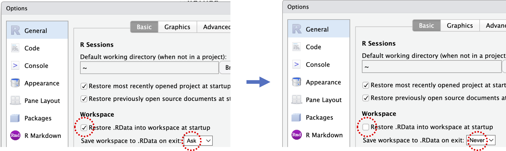

---
format:
  revealjs:
    incremental: false
    css: ../styles.css
execute: 
  echo: true
  code-overflow: scroll
---

# 第3回：Git

<https://data-science-chiba.github.io/day3/>

## RStudioのデフォルト設定を<br>変えましょう

前のセッションのデータが残っていることは<br>再現的に**ダメ**！

. . . 

Tools → Global Options → General → Workspace

- "Restore .RData into workspace at startup" → **外す**
- "Save workspace to .RData on exit:" → **"Never"**

## RStudioのデフォルト設定を<br>変えましょう

前のセッションのデータが残っていることは再現の観点<br>からダメ！

{fig-alt="Screenshot showing how to change Rstudio settings for .RData"}

```{r}
#| echo: false
options(width = 80)
```

## AIを使う時の注意点

- 先週、AIを使ってみました。どんなことに注意が必要だと思った？

## AIを使う時の注意点 

::: {.incremental}
- 取扱注意のデータ
  - このデータをAIに渡してもいいのか？（個人情報など）
  - 研究用に使う前に、**指導教官と相談してください**
- 思う通りの結果にならないことがある
  - 正しく機能した状態に戻れる？
:::

## Gitとは？

- Gitは**バージョン管理ソフトウェア**です。
- MS WordやGoogle Docsの「変更履歴」機能のようなものですが、コード（テキスト）用です。

## なぜGitを使うのか？

- コードを共有するため
  - **再現性**のために重要。他の人があなたのコードにアクセスできなければ、解析を再現できません。
- 解析で試したことの履歴を残すため
  - 何を変更したかを後から確認できます。特に**何かが壊れた時**に重要です。
- コードの開発を整理するため
  - すべての変更（"コミット"）にコメントを付けるので、**どのように**コードを書いているかを意識できます。

## GitHubとは？

- Gitを使ったプロジェクトを管理するためのオンラインツール（サイト）
- コードのクラウドバックアップのような役割も果たす。
- 他の人とコードを簡単に共有できる。

## セットアップ

- パソコンにgitをインストールし、<https://github.com>でアカウントを作成しましょう。

## gitのインストール

- [Mac](https://git-scm.com/download/mac)
  - まずターミナルで`git`と入力して、すでにインストールされているか確認
  - 必要なら[Homebrew](https://brew.sh/)を先にインストール
- [Windows](https://git-scm.com/download/win)
- [Linux](https://git-scm.com/download/linux)

## GitHubアカウントの作成

- <https://github.com/>にアクセスし、案内に従ってアカウントを作成

## GitHub認証：PAT

PAT（Personal Access Token）は特別なパスワードのようなものです。

SSHという別の認証方法もありますが、少し設定が複雑です。

## GitHubでPATを作成

- <https://github.com/settings/tokens>にアクセス

または、Rで`usethis`パッケージをインストールし、

```
install.packages("usethis")
usethis::create_github_token()
```

- スコープ（権限）を確認。「repo」「user」「workflow」がおすすめ。`create_github_token()`を使うと推奨スコープが自動で選択されます。
- 「Generate token」をクリック

## PATの保存

- 発行されたPATをクリップボードにコピー。**まだブラウザを閉じないでください！**
- Rで`install.packages("gitcreds")`を実行し、
- `gitcreds::gitcreds_set()`を実行。
- 先ほどコピーしたPATを入力。これでブラウザを閉じてOKです。

完了！

## PATについての注意

- PATは（デフォルトで30日後に）期限切れになります。
- 期限が切れたら、GitHubで新しいPATを作成し、再度`gitcreds::gitcreds_set()`で登録してください。
- セキュリティのため、有効期限を設定するのがおすすめです。

## トラブルシューティング

`Could not find system git`のようなエラーが出た場合は、[こちら](https://github.com/SBOHVM/RPiR/discussions/444#discussioncomment-1795047)を参照：

`Tools -> Global Options`で`git/svn`タブを選び、`C:\Program Files\Git\bin\git.exe`など、gitの実行ファイルを指定してください。

## gitに自分の情報を登録

gitにGitHubのユーザー名とメールアドレスを教えましょう：

```bash
git config --global user.name "your_github_username"
git config --global user.email "your_email_adress"
git config --global --list
```

## デフォルト設定の変更

- gitでは複数のバージョン（"ブランチ"）を同時に管理できます。
- メインのブランチ名を「main」に設定しましょう：

```bash
git config --global init.defaultBranch main
```

## リポジトリ（repo）について

- 「リポジトリ（repo）」は、プロジェクトのコードやファイルをまとめて保存するフォルダです。

- **gitはリポジトリの中身を管理する**

## リモートとローカルのリポジトリ

- **ローカルリポジトリ**：自分のパソコン上のプロジェクト
- **リモートリポジトリ**：オンライン（GitHub上）のコピー
  - 通常、リモートリポジトリは`origin`という名前で呼ばれます

## クローン（cloning）

まだ自分のパソコンにないリポジトリをダウンロードしたいときは、

- **クローン**＝オンラインのリポジトリを自分のパソコンにコピーすること

## プッシュとプル

リポジトリをセットアップしたら、内容を同期する必要があります。

- **プッシュ**：ローカルの変更をリモートに送る
- **プル**：リモートの変更をローカルに取り込む

## コミット

- **コミット**は、リポジトリに記録される1回分の変更です。

コミットには2つのステップがあります。

## ステージングとコミット

変更したファイルは自動的にgitの履歴に追加されません。

- まず**ステージング**（追加したいファイルや部分を選ぶ）
- 次に**コミットメッセージ**（変更内容の短い説明）を入力
- 最後に**コミット**して履歴に記録します

## `.gitignore`ファイル

gitで管理したくないファイルは、`.gitignore`という特別なファイルにリストアップします。

**生データや出力ファイル**は通常無視するのが良いです。解析そのもの（コード）だけを管理しましょう。

## 実際の流れ

RStudioを使って、典型的なgitのワークフローを一緒に体験します。

細かい説明は[こちら](intro_to_git_ja.qmd)にまとめていますので、参照してください。
