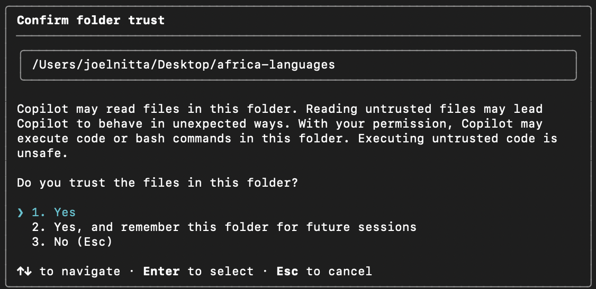
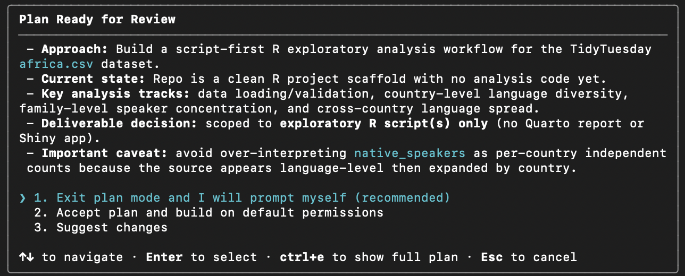

---
format:
  revealjs:
    incremental: false
    css: ../styles.css
execute: 
  echo: true
---

# 第4回：AIエージェント

```{r}
#| echo: false
options(width = 70)
```

<https://data-science-chiba.github.io/day4/>

## AIエージェントとは？

- ブラウザチャット（ChatGPTなど）
  - 対話しながら、コードを書いてもらう

- コードエディタ（RStudioのAI機能など）
  - コメントによるコードの完成

---

- **AIエージェント**
  - 人間の指示に従ってタスクを**自動的に**実行するAIシステム
  - あなたのプロジェクトに入っているファイルの中身を理解して、あなたの指示に従ってコードを書いてくれる
  - ブラウザチャットやコードエディタのAI機能はより**はるかに強力**

## ターミナルについて

- ターミナルは、**コンピュータと対話する**ためのテキストベースのインターフェース
  - 今までは、RStudioのコンソールでRコードを実行していましたが、ターミナルでは、R以外のコマンドも実行できる

---

- GitHub Copilot CLIは、**ターミナルでAIエージェントを使用できる**ソフト（CLI = Command Line Interface） 
  - GitHub Copilot CLIを使うために、まずターミナルの基本的なコマンドを学びましょう
  - ターミナルは広くプログラミングに使われているから、覚えておくと便利です

## ターミナルのインストール（Windowsのみ）

- Git Bashをインストールしていない場合は、以下のリンクからダウンロードしてインストールしてください： <https://gitforwindows.org/>

## ターミナルの開き方

- Windows: スタートメニュー → "Git Bash" と検索して開く

- Mac: Spotlight Search（Cmd + Space） → "Terminal" と検索して開く

- （RStudioのターミナルも使って来ましたが、CoPilot CLIと相性が悪いので、今回はRStudioのターミナルは使わないことにします）

## CoPilot CLI のインストール

- ターミナルのコマンドを使って、GitHub Copilot CLIをインストールしましょう：

- Windows: `winget install GitHub.Copilot`

- Mac: `brew install copilot-cli`

## ターミナルのコマンドについて

- ターミナルでは、マウスを一切使わずに、キーボードだけでコンピュータを操作する
  - パソコンが最初できた頃は、グラフィックユーザーインターフェース（GUI）がなかったため、すべての操作はターミナルで行われていた
  - そのため、多くのコマンドは打ちやすいように短くなっている

## ターミナルの基本的なコマンド

- `pwd`：現在のディレクトリ（フォルダ）を表示する
  - 現在のディレクトリは、**作業ディレクトリ**（working directory）とも呼ばれる
- `ls`：現在のディレクトリにあるファイルやフォルダを表示する

## パスについて

- ターミナルでファイルやフォルダを指定するためには、**パス**を使う必要がある
  - パスは、ファイルやフォルダの場所を示す文字列（住所みたいなもの）
  - 例えば、`/Users/joelnitta/Desktop/`は、デスクトップのパスです

## ターミナルの基本的なコマンド

- `cd`：ディレクトリを移動する
  - `cd ..`は、一つ上のディレクトリに移動するコマンド

- これからは、`cd`コマンドを使って、**RStudioのプロジェクトのディレクトリに移動**してから、CoPilot CLIを使うことにします

## TidyTuesdayについて

- TidyTuesdayは、**毎週火曜日**に公開されるデータセットを使って、データ分析の練習をする組織です

- TidyTuesdayのデータセットは、**GitHub**に公開されているので、誰でもアクセスできます

<https://github.com/rfordatascience/tidytuesday>

## 今日のデータセット: The Languages of Africa

- TidyTuesdayのデータの表から「Data」にある「The Languages of Africa」をクリック
  - データの説明と読み込みのコードが書いてあるページに移動します

---

- 前回学んだ方法で新しいRStudioプロジェクトを作成してから、ターミナルでプロジェクトのディレクトリに移動する
  - プロジェクトの名前は、`africa-languages`にしましょう
  - `Create a git repository`のチェックを入れましょう

## Copilot CLIを使う前に

- これから、Copilot CLIがコードを書いてくれるけど、現状との違いを理解するために、まずは現状を確認して、問題がないようでしたら、`git commit`　で変更を保存しておきましょう

## Copilot CLIを使ってみる

- ターミナルで、`copilot`と入力して、GitHub Copilot CLIを起動する
  - 初めて起動する時は、GitHubアカウントでログインする必要があります

- ChatGPTのようなチャット形式で対話できる

## パーミッションの設定

{}

## パーミッションの重要性

- 今までのAIツールと大きな違い：エージェントは、あなたのプロジェクトのファイルにアクセスして、コードを書いてくれる
  - だから、エージェントがアクセスできるファイルを**制限する**ことが重要

## ChatGPTのようなチャット形式で対話できる

- 例えば、`copilot`を起動した後、以下のように入力してみましょう：

```
How can I use copilot to help me analyze data?
```

## CoPilot CLIのコマンド

- 全てのコマンドはスラッシュ（/）で始まる
  - 例えば、`/help`と入力すると、利用可能なコマンドのリストが表示されます

## Planning Mode

- 実際にコードを書く前に、**Planning Mode**を使って、エージェントにタスクの計画を立ててもらうことができます
  - `/plan`と入力すると、Planning Modeが開始されます

```
/plan I want to use R to analyze African languages. Please read this description of the dataset and help me plan my analysis

https://github.com/rfordatascience/tidytuesday/blob/main/data/2026/2026-01-13/readme.md

Use the tidyverse. I am an R beginner, so please keep the code simple, in one R script, with comments explaining what each part does.
```

---

- CoPilot がしばらく考えてから計画を提案してくれる
- 良さそうな場合、「計画を実行します」のようなオプションを選択して、コードを書いてもらうことができる

{}

## コードの確認

- エージェントがコードを書いてくれたら、**必ずコードを確認**してください
  - コードが正しいかどうか、あなたの意図に合っているかどうかを確認することが重要です

- 自分の思う通りにコードができたことを確認したら、`git commit`で変更を保存しておきましょう

## 課題

- [TidyTuesday](https://github.com/rfordatascience/tidytuesday)から好きなデータセットを選んで、Copilot CLIを使って分析してみましょう
- 前回と同様に、GitHubからリポジトリをクローンして、プロジェクトを作成してから、取り組んでください
  - リポジトリーのリンクは Moodle に載せてあります
  - 締め切り：2026年5月30日（日）23:59

---

- 必ず、コードを確認してから、`git commit`で変更を保存してください
- リモートリポジトリーに変更をプッシュすることで提出になります
  - 私があなたのコードをエラーなしで実行できるようにしてください
  - Moodleでは、自分の言葉で解析の結果を説明してください

